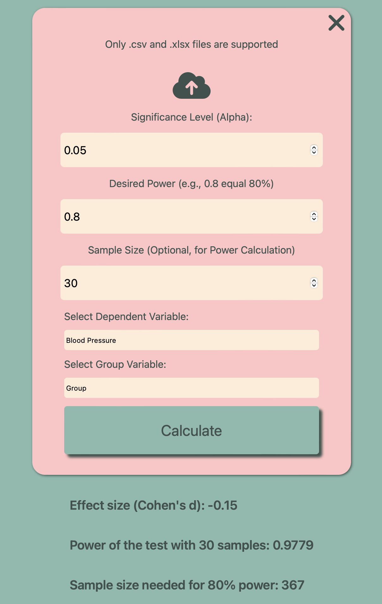

# **Statistical Power Analysis Calculator**

## **Overview**

The Statistical Power Analysis Calculator is a web-based tool designed for scientists, researchers, and statisticians to calculate key statistical metrics such as **effect size (Cohen’s d)**, **statistical power**, and **required sample size** for experiments. These calculations are critical for planning and interpreting experiments, ensuring that studies are sufficiently powered to detect meaningful effects.



## **Key Features**

- **Effect Size Calculation**: Input your control and treatment group data to calculate Cohen's d, which measures the magnitude of differences between two groups.
- **Power Calculation**: Estimate the statistical power of your experiment based on sample size, significance level (alpha), and effect size.
- **Sample Size Determination**: Determine the number of samples needed to achieve a desired level of statistical power (e.g., 80% or 90%).
- **File Upload Support**: Upload CSV or Excel files to quickly analyze experimental data.

## **How It Works**

The application performs several statistical calculations based on the following inputs:

1. **Control Group Data**: Enter your control group data (comma-separated values).
2. **Treatment Group Data**: Enter your treatment group data (comma-separated values).
3. **Significance Level (Alpha)**: Select a significance level (commonly set at 0.05 for a 95% confidence level).
4. **Desired Power**: Choose the statistical power you aim to achieve (e.g., 80%).
5. **Sample Size**: Optionally, input the number of samples to calculate the power for a fixed sample size.
## **Demo**

You can try the live version of this tool here: [Demo Link](https://chrysidoidea.github.io/Statistical-Power-Analysis-Calculator/)
### **Requirements:**
- Node.js
- npm (Node Package Manager)

### **Installation:**

1. Clone the repository:
   ```bash
   git clone https://github.com/your-username/your-repository.git
   ```
2. Navigate to the project directory:
   ```bash
   cd statistical-power-calculator
   ```
3. Install the dependencies:
   ```bash
   npm install
   ```

### **Running the Application Locally:**

1. Start the development server:
   ```bash
   npm run dev
   ```
2. Open your browser and go to `http://localhost:3000` to access the calculator.

### **Deployment:**

To deploy this app on a web server or platform such as Vercel, Netlify, or Heroku, follow their deployment guidelines. You can typically run:

```bash
npm run build
```

This will create a production-ready build of your application.

## **Usage**

1. **Manual Input**: Enter your control and treatment group data manually. Set the alpha (significance level), desired power, and sample size (optional). Click "Calculate" to see the results.
   
2. **File Upload**: You can also upload CSV or Excel files with experimental data for fast calculations.

## **License**

This project is licensed under the MIT License. See the [LICENSE](LICENSE) file for more details.

## **Contributing**

Contributions are welcome! If you’d like to improve the tool, please fork the repository and submit a pull request.

## **Acknowledgments**

This calculator was inspired by the needs of researchers and data scientists for an easy-to-use tool that makes power analysis accessible and efficient for experimental design.e